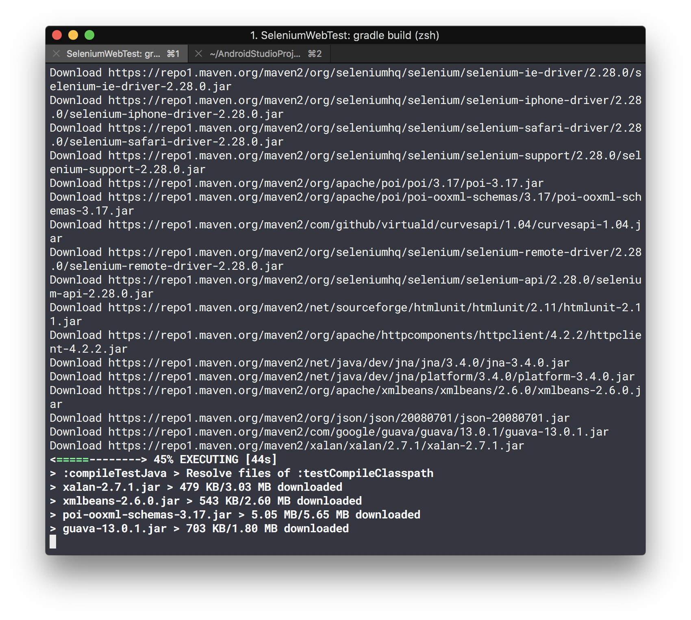

# Selenium TEST

### 一、安装SeleniumIDE插件并录制导出脚本

> 因为SeleniumIDE是FireFox上面的东西 所以我们需要一个Chrome上面的替代品

1. 从Chrome应用市场安装Katalon

2. 点击Record按钮。访问https://psych.liebes.top/st 然后使用学号登录系统

3. 返回Katalon，点击Stop然后Export。format选择为`Java(WebDriver + Junit)`

4. 获得生成的代码

   ```java
   package com.example.tests;

   import java.util.regex.Pattern;
   import java.util.concurrent.TimeUnit;
   import org.junit.*;
   import static org.junit.Assert.*;
   import static org.hamcrest.CoreMatchers.*;
   import org.openqa.selenium.*;
   import org.openqa.selenium.firefox.FirefoxDriver;
   import org.openqa.selenium.support.ui.Select;

   public class UntitledTestCase {
     private WebDriver driver;
     private String baseUrl;
     private boolean acceptNextAlert = true;
     private StringBuffer verificationErrors = new StringBuffer();

     @Before
     public void setUp() throws Exception {
       driver = new FirefoxDriver();
       baseUrl = "https://www.katalon.com/";
       driver.manage().timeouts().implicitlyWait(30, TimeUnit.SECONDS);
     }

     @Test
     public void testUntitledTestCase() throws Exception {
       driver.get("https://psych.liebes.top/st");
       driver.findElement(By.id("username")).click();
       driver.findElement(By.id("username")).clear();
       driver.findElement(By.id("username")).sendKeys("3015204342");
       driver.findElement(By.id("password")).clear();
       driver.findElement(By.id("password")).sendKeys("这里是密码");
       driver.findElement(By.id("submitButton")).click();
       driver.findElement(By.xpath("//p")).click();
     }

     @After
     public void tearDown() throws Exception {
       driver.quit();
       String verificationErrorString = verificationErrors.toString();
       if (!"".equals(verificationErrorString)) {
         fail(verificationErrorString);
       }
     }

     private boolean isElementPresent(By by) {
       try {
         driver.findElement(by);
         return true;
       } catch (NoSuchElementException e) {
         return false;
       }
     }

     private boolean isAlertPresent() {
       try {
         driver.switchTo().alert();
         return true;
       } catch (NoAlertPresentException e) {
         return false;
       }
     }

     private String closeAlertAndGetItsText() {
       try {
         Alert alert = driver.switchTo().alert();
         String alertText = alert.getText();
         if (acceptNextAlert) {
           alert.accept();
         } else {
           alert.dismiss();
         }
         return alertText;
       } finally {
         acceptNextAlert = true;
       }
     }
   }
   ```


### 二、添加项目依赖并且构建

1. 安装ChromeWebDriver：[MacOS](https://www.jianshu.com/p/e137031bc7db)  因为我电脑是MacOS 所以不考虑win了
2. 因为个人比较喜欢Grade了构建系统，编辑build.gradle 添加相关的依赖 然后`gradle build`拉取依赖
5. 
6. 在项目路径/src/test/java/中新建测试类UntitledTestCase，将从Katalon中导出的代码复制到该类中


### 三、编写测试逻辑

1. 使用POI从xlsx中读取信息
2. 对于每一条信息，使用selenium得到网站上Github Url并与从xlsx得到的做比较（`assertEqual()`)


## 四、问题

1. #### xlsx中学号的数据，有字符串有数字 绝望

   有的是普通字符串，有的是数字。如果是数字的会用科学计数法表示，但这明显不是我们想要的。

   在读取的时候先判断一下这个格子中数据的类型，根据类型做不同的处理

   ```Java
   if(row.getCell(cellNum).getCellTypeEnum().equals(CellType.NUMERIC)){
   	userName = new BigDecimal(row.getCell(cellNum).getNumericCellValue()).toString();
   }else {
   	userName = row.getCell(cellNum).getStringCellValue();
   }
   ```

2. #### xlsx中url乱改

   比如xlsx中是https://github.com/xxx/但是网上是https://github.com/xxx（结尾少个**/**)或者结尾多个空格之类的

   ```Java
       private String formatUrl(String url){
           if (url.endsWith("/")){
               return url.substring(0,url.length()-1).trim();
           }
           return url.trim();
       }
   ```


## 运行测试 

`gradle test`